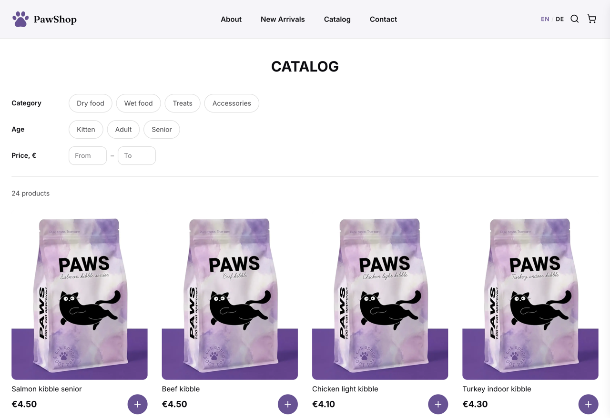
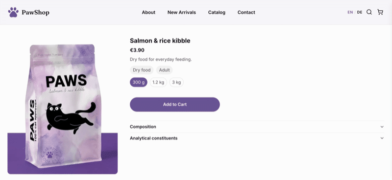

# PawShop

A full-stack e-commerce store for cat supplies, built for the EU market with an English/German storefront. Orders
are submitted as inquiries — no online payment — and a single admin confirms and fulfills each one by hand.

<p align="center">
  <a href="https://paw-shop-eight.vercel.app/"></a>
</p>

<p align="center">
  <a href="https://github.com/cardio-kate/PawShop/actions/workflows/ci.yml"></a>
  
  
  
  
  
  
  
</p>

<p align="center">
  <sub>Next.js 16 · TypeScript · Tailwind · Zustand · PostgreSQL (Neon) · Drizzle ORM · Zod · custom auth (bcrypt + jose) · next-intl · Vercel Blob · Telegram Bot API</sub>
</p>

<p align="center">
  <br>
  <sub>Catalog — category/age/price filters, real product photos</sub>
</p>

<p align="center">
  <br>
  <sub>Picking a variant and adding it to the cart</sub>
</p>

## Features

- EN/DE storefront (`next-intl`), server-rendered for SEO — catalog with category/age/price filters, search,
  and per-product `generateMetadata`
- Cart & checkout as an inquiry, not a payment: the server always recalculates prices from the database,
  client-side totals are never trusted
- Custom auth (bcrypt + JWT via `jose`) protecting a single-admin dashboard, with session versioning and
  rate-limited login/password reset
- Admin dashboard for products & variants, delivery countries, orders, and incoming contact messages
- Telegram notifications on new orders and contact messages (outbound only)
- Jest unit + integration tests (integration runs against a dedicated Neon branch) wired into CI

Full documentation lives in [`/docs`](./docs):

- [`docs/product-spec.md`](./docs/product-spec.md) — product spec (technical requirements)
- [`docs/architecture.md`](./docs/architecture.md) — project architecture
- [`docs/design.md`](./docs/design.md) — design system

## Development process

This project was built with Claude Code as an AI pair programmer, working from written specs
([`docs/architecture.md`](./docs/architecture.md), [`docs/product-spec.md`](./docs/product-spec.md),
[`docs/design.md`](./docs/design.md)) and project engineering rules ([`CLAUDE.md`](./CLAUDE.md)).

## Getting started

```bash
npm install
cp .env.example .env    # fill in Neon connection strings, JWT_SECRET, Telegram bot token, Vercel Blob token
npm run db:generate && npm run db:migrate
npm run dev
```

First-time setup (after the first migration):

```bash
npm run create-admin
npm run seed:categories
npm run seed:delivery-countries
```

## Scripts

| Command                                                 | Purpose                    |
| -------------------------------------------------------- | --------------------------- |
| `npm run dev`                                           | local development          |
| `npm run build` / `npm run start`                       | production build and start |
| `npm run lint` / `npm run typecheck` / `npm run format` | static checks               |
| `npm run db:generate` / `db:migrate` / `db:studio`      | Drizzle migrations          |
| `npm run test` / `test:unit` / `test:integration`       | Jest                        |
