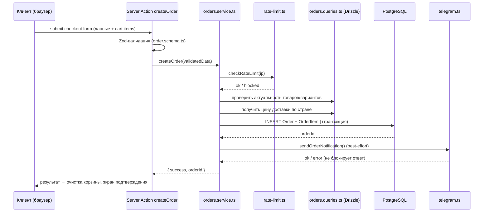

# Архитектура проекта PawShop

> Основано на ТЗ `ТЗ_PawShop_2.md` и зафиксированном стеке: Next.js (App Router) + TypeScript + Tailwind + Zustand + Drizzle ORM + PostgreSQL (Neon) + Zod + собственная auth (bcrypt + JWT) + Telegram Bot API + Vercel Blob/Cloudinary + деплой на Vercel.

---

## 0. Принципы архитектуры

1. **Монолит внутри одного Next.js-приложения.** Отдельный backend-сервис не нужен — Server Actions и Server Components полностью закрывают потребности проекта такого масштаба. Разделение на "фронт" и "бэк" — логическое (по папкам и слоям), а не физическое (не два деплоя, не два репозитория).
2. **Слоистая структура внутри монолита**, чтобы код не превращался в "actions с SQL внутри":
   `UI (components) → Actions (тонкие) → Services (бизнес-логика) → Queries/Repositories (доступ к БД) → Postgres`
3. **Внешние интеграции (Telegram, файловое хранилище) — через интерфейсы-адаптеры.** Провайдера можно сменить, не трогая компоненты и actions.
4. **Без переусложнения:** никаких микросервисов, очередей, отдельного API-gateway, GraphQL — для одного админа и каталога без онлайн-оплаты это избыточно.
5. **Задел на рост без усложнения сейчас:** чистые границы слоёв дают возможность позже вынести `services` в отдельный сервис или заменить Server Actions на REST/tRPC — без переписывания бизнес-логики.

---

## 1. Общая схема взаимодействия

```
┌─────────────────────────────┐
│   Browser                    │
│   React Client Components    │
│   Zustand (cart, persist)    │
└──────────────┬───────────────┘
               │  Server Actions / RSC fetch
               ▼
┌─────────────────────────────────────────────┐
│   Next.js Server (Vercel)                     │
│                                                │
│  /app  — Server Components, layouts, страницы │
│  /actions — тонкие server actions             │
│  /lib/services — бизнес-логика                │
│  /lib/db/queries — доступ к БД (Drizzle)       │
│  /lib/auth.ts — JWT/bcrypt                     │
│  /lib/storage — адаптер загрузки изображений   │
│  /lib/telegram.ts — уведомления                │
└───────┬───────────────────┬───────────────────┘
        │                   │
        ▼                   ▼
┌───────────────┐   ┌─────────────────────┐
│ PostgreSQL      │   │ Внешние сервисы       │
│ (Neon, serverless)│  │ Telegram Bot API      │
└───────────────┘   │ Vercel Blob / Cloudinary│
                     └─────────────────────┘
```

Поток создания заказа (пример сквозного сценария):



---

## 2. Структура проекта (развёрнутая)

```
/
├── proxy.ts                        # проверка JWT-cookie перед /nine-lives/dashboard/** + locale-negotiation (см. §3.10)
├── next.config.ts                 # output: 'standalone' (задел на перенос с Vercel) + images.remotePatterns под домен Vercel Blob / Cloudinary — без этого next/image откажется оптимизировать внешние фото товаров
├── drizzle.config.ts
├── tailwind.config.ts
├── tsconfig.json
├── .env.example
├── package.json
│
├── /app
│   ├── globals.css
│   ├── sitemap.ts                 # генерация sitemap.xml по активным товарам (обе локали, см. §3.10) и статическим страницам
│   ├── robots.ts                  # генерация robots.txt
│   │
│   ├── /[locale]                  # 'en' | 'de' — см. §3.10 «Мультиязычность»; свой корневой layout (<html lang={locale}>), без общего app/layout.tsx над ним (route groups, «multiple root layouts» — перепроверить по node_modules/next/dist/docs для Next 16)
│   │   ├── layout.tsx             # <html lang={locale}>/<body>, NextIntlClientProvider, глобальные провайдеры
│   │   └── /(storefront)
│   │       ├── layout.tsx             # Header + Footer
│   │       ├── page.tsx               # главная: баннер, New Arrivals (превью, без сетки каталога)
│   │       ├── /catalog/page.tsx      # весь каталог: фильтры, сетка, пагинация (ТЗ §7.2а)
│   │       ├── /product/[slug]/page.tsx   # slug общий на обе локали, см. §3.10
│   │       ├── /checkout/page.tsx     # отдельная широкая страница оформления заказа (ТЗ §7.5) — двухколоночная раскладка, не помещается в панель корзины (400px), см. DESIGN.md → Layout → Cart item
│   │       ├── /delivery/page.tsx
│   │       ├── /privacy-policy/page.tsx   # статический контент, см. ТЗ §7.9
│   │       └── /contact/page.tsx      # статический контент, см. ТЗ §7.10 — добавлено сверх исходного ТЗ
│   │
│   └── /(admin)                   # второй, нелокализованный корневой layout — см. §3.10
│       ├── layout.tsx             # <html lang="en">/<body>
│       ├── /staff-entry
│       │   └── page.tsx           # вход администратора — публичный, вне proxy.ts
│       └── /nine-lives
│           └── /dashboard
│               ├── layout.tsx         # сайдбар, отдельный от публичной навигации, проверка сессии на уровне layout
│               ├── /products
│               │   ├── page.tsx
│               │   ├── /new/page.tsx
│               │   └── /[id]/edit/page.tsx
│               ├── /orders
│               │   ├── page.tsx
│               │   └── /[id]/page.tsx
│               └── /delivery/page.tsx
│
├── /components
│   ├── /ui           # Button, Input, Select, Modal, Badge — без бизнес-логики
│   ├── /layout        # Header, Footer, AdminSidebar
│   ├── /product        # ProductCard, ProductGallery, VariantSelector, Filters
│   ├── /cart           # CartDrawer, CartItem, CartButton, CartSummary
│   ├── /checkout        # CheckoutForm, CountrySelect, OrderConfirmation
│   ├── /auth            # StaffLoginCard — карточка с внутренним состоянием login/forgot/reset/reset-success (см. DESIGN.md → Components → Staff login card)
│   └── /admin          # ProductForm, ProductTable, OrderTable, ImageUploader
│
├── /lib
│   ├── /db
│   │   ├── schema.ts             # Drizzle-схема — единственный источник правды
│   │   ├── index.ts              # два клиента: dbHttp (neon-http, чтение) + dbPool (neon-serverless/Pool, транзакции — см. раздел 4)
│   │   ├── /migrations           # автосгенерированные drizzle-kit миграции
│   │   └── /queries              # ТОЛЬКО доступ к БД, без бизнес-правил
│   │       ├── products.queries.ts
│   │       ├── orders.queries.ts
│   │       ├── delivery.queries.ts
│   │       └── admin.queries.ts
│   │
│   ├── /services                 # бизнес-логика, вызывает queries + интеграции
│   │   ├── products.service.ts   # цена = min(активные варианты) и т.д.
│   │   ├── orders.service.ts     # пересчёт суммы, проверка актуальности корзины
│   │   ├── auth.service.ts       # логика попыток входа, блокировка, reset-код
│   │   └── delivery.service.ts
│   │
│   ├── auth.ts                   # JWT sign/verify, bcrypt hash/compare, cookie
│   │
│   ├── /storage
│   │   ├── storage.interface.ts  # upload(file), delete(url)
│   │   └── vercel-blob.provider.ts  # реализован сейчас; cloudinary.provider.ts добавляется позже за тем же интерфейсом, если реально понадобится сменить провайдера
│   │
│   ├── telegram.ts                # sendOrderNotification, sendResetCode (try/catch)
│   │
│   ├── rate-limit.ts                # rate limit по IP для createOrder/requestPasswordReset — см. раздел 3.8
│   │
│   ├── /validation                # zod-схемы — общие для клиента и сервера
│   │   ├── product.schema.ts
│   │   ├── order.schema.ts
│   │   ├── delivery.schema.ts
│   │   └── auth.schema.ts
│   │
│   ├── /store
│   │   └── cart.store.ts          # Zustand + persist(localStorage)
│   │
│   ├── constants.ts                # лимиты попыток входа, TTL reset-кода, порог/окно rate limit для createOrder/requestPasswordReset
│   └── utils.ts
│
├── /actions                        # тонкие server actions
│   ├── products.actions.ts
│   ├── orders.actions.ts
│   ├── delivery.actions.ts
│   └── auth.actions.ts
│
├── /types
│   └── index.ts                    # часть типов — InferSelectModel из schema.ts,
│                                    # часть — z.infer из zod-схем (без дублирования)
│
├── /scripts
│   ├── create-admin.ts              # разовый запуск после первого деплоя (раздел 3.4, п.5)
│   ├── seed-categories.ts           # разовый запуск после миграции (раздел 3.4, п.6 / 3.7)
│   └── seed-delivery-countries.ts   # разовый запуск после миграции (раздел 3.4, п.7 / 3.9)
│
├── /public
└── /tests
    ├── /unit                       # lib/services — чистые функции, без БД
    └── /integration                # actions + тестовая БД
```

**Почему страница входа вынесена в `/staff-entry`, а не лежит в `/nine-lives/page.tsx`:** в App Router URL страницы определяется расположением папки, а не комментарием в коде. ТЗ §7.7 прямо требует, чтобы адрес входа **не совпадал** с адресом самой админ-панели — если файл логина физически лежит в `/app/nine-lives/page.tsx`, его реальный URL всё равно `/nine-lives`, что бы ни было написано в комментарии рядом. Поэтому логин — отдельный маршрут верхнего уровня `/staff-entry`, а `/nine-lives/dashboard/**` остаётся защищённой зоной с собственным layout и сайдбаром (изначально этот раздел назывался `/admin/dashboard/**` — переименован в `/nine-lives` тем же приёмом снижения шума от ботов-сканеров, что и раньше для `/staff-entry`, теперь уже осмысленно, когда `proxy.ts` реально проверяет сессию, не только маскирует путь). Верхнего `nine-lives/layout.tsx` без вложенного `dashboard` больше нет — он был не нужен: единственное, что он давал (отсутствие публичной навигации), уже даёт `dashboard/layout.tsx`.

**Почему `queries` и `services` разделены, а не одна папка `lib/db`:** `queries` — это только SQL/Drizzle-запросы (`getProductBySlug`, `insertOrder`), без единого "если". `services` — это правила проекта ("цена товара = минимум среди активных вариантов", "при оформлении заказа пересчитать сумму по актуальным ценам, а не доверять клиенту"). Если положить всё в actions, тестировать бизнес-правила без поднятия Next.js-рантайма будет невозможно — а именно это чаще всего нужно проверять юнит-тестами.

**Все файлы в `/lib/db`, `/lib/auth.ts`, `/lib/telegram.ts`, `/lib/storage/*.provider.ts` должны начинаться со строки `import 'server-only'`.** Это не опция, а страховка: если кто-то (человек или агент) по ошибке импортирует такой модуль в компонент с `'use client'`, сборка упадёт с понятной ошибкой — вместо того, чтобы молча зашить `DATABASE_URL`/`JWT_SECRET`/токен бота в клиентский JS-бандл, где это заметят не сразу.

**Готча: `server-only` и `drizzle-kit`.** Пакет `server-only` резолвится в пустышку только когда бандлер выставляет условие экспорта `react-server` (так делает сборка Next.js и — отдельно — `next/jest`, поэтому тесты эту строку не ломают). `drizzle-kit` импортирует `lib/db/schema.ts` напрямую через обычный Node, без этого условия, и без обхода падает с `This module cannot be imported from a Client Component module`. Решение — не убирать `server-only` из `schema.ts` (это ослабило бы защиту без причины, самого секрета в файле и так нет, но правило одно на весь `lib/db/**`), а передавать Node то же условие явно: `npm run db:generate`/`db:migrate`/`db:studio` в `package.json` уже делают это через `NODE_OPTIONS=--conditions=react-server` перед `drizzle-kit`. Если когда-нибудь понадобится вызвать `drizzle-kit` в обход этих npm-скриптов — не забыть этот флаг, иначе снова та же ошибка.

---

## 3. Потоки данных по слоям

### 3.1 Публичное чтение (SSR/SSG + ISR)
`Server Component (page.tsx)` → вызывает `services` (или напрямую `queries`, если правил нет) → Drizzle → Postgres → HTML рендерится на сервере.
Для `/product/[slug]` используется `generateStaticParams` + кэш с тегами (`unstable_cache` / `revalidateTag('products')`). Когда админ меняет товар — `updateProduct` action вызывает `revalidateTag('products')`, и публичная страница обновляется мгновенно, а не ждёт TTL.

**SEO-элементы, ради которых выбран SSR/SSG (обоснование в §1 ТЗ), реализуются явно, а не подразумеваются.** Каждая страница каталога и карточки товара экспортирует `generateMetadata` (title, description, canonical URL, Open Graph — как минимум `og:title`/`og:image` из первой картинки товара). На уровне `/app` — `sitemap.ts` (список активных товаров и статических страниц) и `robots.ts`, оба используют те же `queries`, что и страницы каталога, без дублирования логики.

**Поиск по каталогу (§7.1, §11 ТЗ) — параметр `search` внутри `getProducts(filters)`, не отдельный action.** Реализуется как `WHERE <локализованное имя> ILIKE '%' || search || '%'` в `products.queries.ts` — только по имени товара для текущей локали (`nameEn`/`nameDe` с fallback, см. раздел 3.10), без description/`flavor`/категории (сознательно узкий охват, см. ТЗ §11). Комбинируется с остальными фильтрами (`category`/`ageGroup`/цена) и пагинацией через `AND` в том же SQL-запросе, а не отдельным проходом по уже отфильтрованному списку в JS.

**Кэш и инвалидация для `DeliveryCountry`.** По тому же принципу, что и `products`: `getDeliveryCountries()` кэшируется тегом `delivery` (`unstable_cache(..., { tags: ['delivery'] })`), а `updateDeliveryCountry` вызывает `revalidateTag('delivery')`. Без этого правка цены/срока доставки в админке доходила бы до публичной страницы `/delivery` и до `CountrySelect` в форме заказа (§7.5 ТЗ) только по истечении TTL, а не сразу — при том что `getProducts`/`getProductBySlug` такую задержку уже явно не допускают.

**Блок «You may also like» (§7.3 ТЗ) — `getRelatedProducts(productId)` в `products.queries.ts`.** `WHERE ageGroup = (SELECT ageGroup FROM products WHERE id = productId) AND id != productId AND isActive = true ORDER BY createdAt DESC LIMIT 4` — подбор по той же возрастной группе, не по категории; если подходящих меньше 4, возвращается сколько есть, без добора из других `ageGroup`. Кэшируется тем же тегом `products`, что и страница товара (см. ниже), инвалидируется вместе с ней.

**Важно зафиксировать мажорную версию Next.js в `package.json` осознанно.** Дефолты кэширования `fetch` и GET route handlers существенно менялись между 14 и 15 версией (в 15 кэш по умолчанию выключен там, где раньше был включён). Описанная здесь схема (`unstable_cache` + `revalidateTag`) не зависит от этих дефолтов напрямую, но при первой настройке стоит явно проверить поведение на той версии, которая реально указана в `package.json`, а не полагаться на память о поведении "Next.js вообще".

### 3.2 Мутации (Server Action)
Каждый action делает строго:
1. (для админских) проверка сессии — `lib/auth.ts`
2. валидация входных данных — Zod из `/lib/validation`
3. вызов соответствующей функции `services`
4. `revalidateTag`/`revalidatePath` для затронутых страниц
5. типизированный ответ клиенту (`{ success, data }` или `{ success: false, errors }`)

Actions **не содержат** SQL и бизнес-условий напрямую — это обязанность `services`. Это единственное правило, которое стоит соблюдать строго: иначе логика расползается по 10 файлам и её невозможно переиспользовать/тестировать.

*Отдельный CSRF-токен вручную городить не нужно* — Next.js по умолчанию сверяет `Origin`/`Host` заголовки для POST-запросов Server Actions. Важно только не отключать эту проверку явно в конфиге.

### 3.3 Корзина
Полностью на клиенте (Zustand + persist), сервер о ней не знает до чекаута. При `createOrder` содержимое корзины (productId, variantId, quantity) отправляется на сервер и **перепроверяется** в `orders.service.ts`: недоступные позиции исключаются, цены берутся из БД, а не из клиента — это закрывает граничный случай из ТЗ (товар удалён из каталога, но остался в открытой корзине).

**Гидратация счётчика корзины в Header.** Сервер при первом рендере не знает содержимое `localStorage` — счётчик товаров на иконке корзины на SSR всегда будет `0`, а сразу после гидрации на клиенте может измениться на реальное число. Это классический React hydration mismatch (предупреждение "текст не совпадает с серверным рендером") плюс визуальное "моргание" `0 → N`. Закрывается стандартным приёмом для `persist`: `persist(..., { skipHydration: true })` в `cart.store.ts` + ручной вызов `useCartStore.persist.rehydrate()` внутри `useEffect` на клиенте (или рендер счётчика только после `mounted`-флага). Без этого в проде почти гарантированно всплывёт консольный warning на каждой странице.

*Повторная отправка заказа — сознательно принятый риск, а не забытый кейс.* ТЗ фиксирует защиту только на клиенте (блокировка кнопки после первого клика до ответа сервера). Это не исключает теоретический дубль при гонке двух вкладок/ретрае сети. Серверную идемпотентность (idempotency key на заказ) сознательно **не закладываем** на этом масштабе — один канал продаж, ручная обработка менеджером, риск низкий, а сложность неоправданная. Если это решение когда-нибудь пересматривать — начинать здесь, а не заново обсуждать с нуля.

### 3.4 Авторизация администратора
- `proxy.ts` — проверяет httpOnly JWT-cookie только для `/nine-lives/dashboard/**`. Страница логина (`/staff-entry`) — отдельный маршрут верхнего уровня, вне этой проверки (см. раздел 2 и пояснение под деревом файлов).
- `lib/auth.ts` — низкоуровневые примитивы: `signSession`, `verifySession`, `hashPassword`, `comparePassword`.
- `auth.service.ts` — правила: подсчёт `failedLoginAttempts`, установка `lockedUntil`, генерация и проверка `resetToken` с TTL 15 минут.
- Восстановление пароля: `requestPasswordReset` → генерирует код → `telegram.ts` отправляет его в `Admin.telegramChatId` → `resetPassword` хэширует введённый код (`sha256`) и сравнивает с `Admin.resetTokenHash`, проверяет срок → обновляет `passwordHash` → сбрасывает `resetTokenHash`.
- **В БД хранится хэш токена, не сам токен.** `Admin.resetTokenHash` — `sha256` от сырого `resetToken` (по аналогии с `passwordHash`, но `sha256` достаточно — это не пароль пользователя, а короткоживущий одноразовый код с высокой энтропией, bcrypt тут избыточен). Сырой токен уходит только в Telegram-сообщение и никогда не пишется в БД в открытом виде — иначе утечка БД (бэкап, доступ к реплике) даёт готовый токен сброса пароля без необходимости что-либо перебирать в оставшееся окно TTL.
- **Инвалидация сессий после сброса пароля.** JWT — механизм без состояния и сам по себе не «отзывается» до истечения `JWT_EXPIRES_IN`. Чтобы сброс пароля реально закрывал доступ по старым, уже выданным токенам, в payload JWT кладётся текущее значение `Admin.sessionVersion`, а `resetPassword` инкрементирует это поле в той же транзакции, где обновляется `passwordHash`. `verifySession` (и в `proxy.ts` через `jose`, и в `requireAdminSession()`) сверяет `sessionVersion` из токена со значением в БД — несовпадение считается недействительной сессией.
- **`resetToken` — длинная криптографически случайная строка** (например, `crypto.randomBytes(32).toString('hex')`), а не короткий числовой PIN. Это принципиально: короткий код, который удобно продиктовать/скопировать из Telegram, за 15 минут действия токена реально перебрать вручную или скриптом, если на `resetPassword` нет отдельного ограничения попыток. Длинный токен закрывает этот риск самой энтропией, без необходимости городить второй счётчик неудачных попыток отдельно от `failedLoginAttempts`.

**Важные технические ограничения, которые нужно соблюдать буквально:**

1. **`proxy.ts` в Next 16 по умолчанию выполняется в Node.js runtime, а не в Edge** — в отличие от `middleware.ts` в Next 14/15, откуда это ограничение изначально пришло (см. раздел 9, «Историческая справка»). Формально это снимает технический запрет на `bcrypt`/`jsonwebtoken` прямо в этом файле, но разделение всё равно сохраняется — уже не как обход ограничения рантайма, а как осознанное решение ради единообразия:
   - для верификации JWT используется `jose` — она одинаково работает и в Node.js, и в Edge Runtime, и используется и в `proxy.ts`, и в `requireAdminSession()`, так что способ проверки токена не раздваивается между двумя разными библиотеками;
   - `bcrypt`/сравнение пароля выполняется **только** внутри Server Actions (`auth.actions.ts` → `auth.service.ts`) — не потому что `proxy.ts` технически не потянет `bcrypt`, а чтобы вся логика хэширования пароля жила в одном слое (`services`), а не была размазана между `proxy.ts` и `services`.
   - `lib/auth.ts` содержит два независимых блока: верификация сессии (`jose`, используется и в `proxy.ts`, и в actions) и хэширование пароля (`bcrypt`, используется только в actions).

2. **`proxy.ts` — это не единственная линия защиты.** Он ограждает *рендер страниц* под `/nine-lives/dashboard/**`, но каждый административный Server Action должен **самостоятельно** проверять сессию в начале своего тела (например, через общий хелпер `requireAdminSession()` из `lib/auth.ts`), а не полагаться на то, что до него "не долетит" неавторизованный вызов. Это дешёвая защита в глубину, и без неё при рефакторинге легко случайно обнажить action.

3. **`failedLoginAttempts`/`lockedUntil` намеренно хранятся в БД, а не в памяти процесса.** Serverless-функции на Vercel не гарантируют переиспользование инстанса между запросами — счётчик в обычной JS-переменной/`Map` будет обнуляться непредсказуемо и не даст реальной защиты от брутфорса. Держать это только в БД — не архитектурная прихоть, а единственный вариант, который вообще работает в serverless-среде.

4. **Cookie-флаги** для JWT-сессии: `httpOnly: true`, `sameSite: 'lax'`, `secure: process.env.NODE_ENV === 'production'`. Если жёстко зашить `secure: true`, логин молча перестанет работать в локальной разработке по `http://localhost` — это частая причина "у меня на проде работает, а локально нет" именно в такой связке.

5. **Создание первого администратора.** Публичной регистрации нет по ТЗ — значит, единственная запись `Admin` должна появиться заранее. Нужен отдельный одноразовый скрипт `scripts/create-admin.ts` (bcrypt-хэширует пароль, вставляет строку с `username`/`passwordHash`), который запускается вручную один раз после первого деплоя/миграции — а не форма в UI (доступна по маршруту `/staff-entry`, который к этому моменту уже должен вести на реальный аккаунт). Отдельно: `Admin.telegramChatId` нельзя получить программно "из воздуха" — администратор должен один раз написать боту любое сообщение, после чего `chat_id` берётся через `getUpdates` Telegram Bot API и вручную сохраняется в БД (тем же скриптом или прямым UPDATE). Это разовая ручная операция настройки, но если её не запланировать — уведомления и восстановление пароля просто не будут работать, и будет неясно, почему.

6. **Создание категорий (`scripts/seed-categories.ts`).** По той же логике, что и создание первого администратора: ТЗ не предусматривает CRUD для `Category` в админ-панели (см. раздел 3.7 ниже) — 4 записи (`Dry food`, `Wet food`, `Treats`, `Accessories`) заводятся один раз отдельным сид-скриптом после миграции, а не через UI. Без этого шага форма создания товара (`ProductForm`) откроется с пустым `<select>` категорий и не даст создать ни одного товара.

7. **Создание стран доставки (`scripts/seed-delivery-countries.ts`).** Аналогично категориям, но не идентично: ТЗ не предусматривает server action на **создание** страны (`createDeliveryCountry` в списке §5 ТЗ нет) — список стран ЕС со стартовыми `price`/`estimatedDays` заводится один раз сид-скриптом после миграции (см. раздел 3.9 ниже). В отличие от `Category`, дальнейшее **редактирование** уже существующих строк (`price`, `estimatedDays`, `isActive`) из админки предусмотрено — `updateDeliveryCountry` в разделе «Delivery» (§7.8 ТЗ). Без этого шага и `/delivery`, и `CountrySelect` в форме заказа откроются с пустым списком стран.

### 3.5 Изображения товаров
**Важно: файлы не прогоняются через Server Action целиком.** У Server Actions в Next.js по умолчанию лимит тела запроса ~1 МБ (настраивается через `experimental.serverActions.bodySizeLimit`, но поднимать его до размеров фото — плохое решение: функция будет держать в памяти весь файл и упрётся в лимиты по времени/памяти serverless-функции).

Правильный поток:
1. Клиент (форма товара) запрашивает у сервера **короткоживущий client-upload токен** — маленький Server Action или Route Handler, который не принимает файл, а только выдаёт разрешение на загрузку (Vercel Blob и Cloudinary оба поддерживают такой сценарий "signed client upload").
2. Браузер грузит файл **напрямую** в Vercel Blob / Cloudinary, минуя Next.js-сервер.
3. На сервер (в Server Action сохранения товара) уходит только полученный URL — маленький, укладывается в любые лимиты.
4. `lib/storage` (интерфейс `storage.interface.ts`) абстрагирует это для обоих провайдеров, так что компоненты и actions не знают, какой провайдер выбран — это правка одной переменной `.env` (`STORAGE_PROVIDER`), а не кода.

Дополнительно: при замене или soft-delete фото товара нужно явно вызывать `storage.delete(oldUrl)` в `products.service.ts` — иначе старые файлы остаются в хранилище навсегда и его стоимость растёт без пользы (провайдер сам их не чистит). Размер и MIME-тип файла проверяются дважды: на клиенте (для UX, сразу) и на сервере при выдаче upload-токена (потому что клиенту доверять нельзя).

**`next/image` и внешние домены.** Фото хранятся не в `/public`, а на стороннем хосте (Vercel Blob / Cloudinary) — компонент `<Image>` по умолчанию откажется оптимизировать картинку с домена, которого нет в `images.remotePatterns` в `next.config.ts`. Это нужно прописать сразу для домена реально используемого провайдера, иначе фото товаров просто не отрендерятся при первом деплое с настоящими данными (при разработке на моках это часто остаётся незамеченным).

**Один провайдер сейчас, а не два.** `storage.interface.ts` даёт возможность безболезненно сменить провайдера, но поддерживать *обе* реализации (`vercel-blob.provider.ts` и `cloudinary.provider.ts`) параллельно с первого дня — небольшая избыточность для проекта с одним админом и одним каналом загрузки фото. Практичнее реализовать сейчас только `vercel-blob.provider.ts` (нет отдельной регистрации аккаунта, нативная интеграция с тем же Vercel, где уже деплой) за общим интерфейсом, а `cloudinary.provider.ts` дописать только если реально возникнет причина сменить провайдера.

### 3.6 Telegram-уведомления
Вызываются из `services` (не из actions напрямую) **после** успешной записи в БД, всегда обёрнуты в `try/catch`. Падение Telegram не откатывает и не блокирует уже сохранённый заказ — это прямое требование ТЗ (раздел 12). Интеграция полностью одностороняя (`sendMessage`) — входящий webhook/endpoint для приёма апдейтов от бота проекту не нужен и не должен добавляться. Состав сообщения — по ТЗ §9: товары, суммы, контакты, адрес и **`comment`, если поле заполнено** — без этого поля менеджер узнаёт пожелание/уточнение клиента только открыв заказ в админке, теряя смысл мгновенного уведомления.

**Экранирование пользовательского ввода.** `customerName`, `street`, `city`, `comment` — свободный текст клиента, не выбор из списка. Если сообщение форматируется через `parse_mode: 'MarkdownV2'` (обычная практика ради жирного заголовка/сумм), Telegram Bot API отклоняет **весь** запрос при любом неэкранированном спецсимволе MarkdownV2 (`. - ( ) ! ' _ * [ ] ~ \` > # + = | { }`) — а это почти любой реальный адрес («Apt. 4», «Müller-Straße 12») или комментарий с точкой на конце. Поскольку падение Telegram сознательно проглатывается `try/catch` (см. выше) и не возвращается клиенту как ошибка, без экранирования уведомления не будут доходить *систематически*, а не изредка, и это останется незамеченным. `lib/telegram.ts` обязан экранировать значения пользовательских полей перед подстановкой в текст с `parse_mode` (например, `str.replace(/[_*[\]()~`>#+\-=|{}.!]/g, '\\$&')`) — либо, как более простой и надёжный вариант, не использовать `parse_mode` вовсе и отправлять сообщение как обычный текст.

**Удаление данных из Telegram по запросу клиента.** Если клиент запрашивает удаление своих персональных данных (ТЗ §7.9), запись заказа в Postgres — не единственная копия: то же сообщение с именем/адресом/телефоном/комментарием осталось в Telegram-чате администратора. Полное удаление данных клиента требует, чтобы администратор вручную удалил и это сообщение — процесс описан в ТЗ §7.9, но программно нигде не автоматизируется: интеграция односторонняя (`sendMessage`, см. выше), входящий Telegram API для программного удаления сообщений в проекте сознательно не используется.

### 3.7 Категории (`Category`) — фиксированный справочник, не CRUD-сущность
В ТЗ `Category` присутствует в модели данных, участвует в фильтрах каталога и в форме создания товара, но нигде не имеет собственного раздела в админ-панели и ни одного server action на создание/изменение. Это осознанное решение, а не пропуск: категорий четыре (`Dry food`, `Wet food`, `Treats`, `Accessories`) и меняются крайне редко — полноценный CRUD ради 4 строк был бы лишней сложностью, прямо противоречащей принципу раздела 0. Отдельной колонки «Type» в таблицах каталога ТЗ §3.1/§3.2 нет — соответствие категорий строкам каталога ручное (`Dry food`/`Wet food` — по колонке Format §3.1, `Treats` — по одноимённому подразделу §3.1, `Accessories` — по таблице §3.2), выбирается при заполнении сид-скрипта и формы товара, а не парсится программно.

- Категории заводятся один раз через `scripts/seed-categories.ts` (см. п.6 выше), а не через UI.
- `getCategories()` — простой публичный query (без отдельного action-файла, вызывается напрямую из `products.queries.ts` там, где нужен список для фильтров/формы) — данные почти никогда не меняются, поэтому агрессивно кэшируются (`unstable_cache` с длинным TTL, инвалидация не нужна).
- `ProductForm` в админке получает список категорий как `<select>` из уже существующих записей — создать новую категорию прямо из формы товара нельзя.
- Если в будущем понадобится управлять категориями из UI без разработчика — это отдельная, сознательно отложенная задача (по аналогии с тем, как в проекте уже отложена онлайн-оплата), а не забытый кейс архитектуры.

### 3.8 Защита публичных мутаций от злоупотреблений (rate limiting)
`createOrder` и `requestPasswordReset` — оба публичные Server Actions без авторизации (сессии на момент
вызова ещё нет), поэтому клиентской блокировки кнопки «Place Order» (см. §12 ТЗ) недостаточно: прямой
вызов action в обход интерфейса ничем не ограничен. `requestPasswordReset` дополнительно не покрывается
`failedLoginAttempts`/`lockedUntil` — тот считает только попытки `adminLogin`, а не запросы на генерацию
`resetToken`; без отдельного лимита эндпоинт можно долбить, заспамив Telegram единственного админа
(`sendResetCode`) или исчерпав квоту Bot API. Для обоих actions вводится простой rate limit по IP — без
дополнительной инфраструктуры (Upstash/Redis не нужны при таком масштабе):
- `lib/rate-limit.ts` — счётчик запросов по IP (заголовок `x-forwarded-for`) с фиксированным окном в
  несколько минут. Дизайн таблицы — **одна строка на `(ip, windowStart)`** (`windowStart` — начало
  текущего окна, округлённое до его длины), не строка на каждую попытку: проверка лимита — атомарный
  `INSERT ... ON CONFLICT (ip, window_start) DO UPDATE SET count = count + 1 RETURNING count`, сравнение
  со порогом — уже после атомарной записи. Это не предпочтение стиля, а защита от гонки: наивное
  «прочитать счётчик → сравнить → записать» в JS позволяет двум параллельным запросам с одного IP синхронно
  пройти проверку до того, как один из них успеет увеличить счётчик. Таблица в том же Postgres, по тому же
  принципу, что и блокировка логина: не требует внешних сервисов и работает одинаково что на Vercel, что на
  VPS, не нарушая принцип портируемости из раздела 6. Правило Vercel Firewall можно использовать как
  дополнительный, чисто платформенный уровень защиты, пока проект остаётся на Vercel, но не как
  единственную реализацию — иначе логика лимита привязывается к конкретному хостингу.
- Проверка вызывается в начале `orders.service.ts` (для `createOrder`) и `auth.service.ts` (для `requestPasswordReset`) до мутации; при превышении лимита action возвращает `{ success: false, errors }` без создания заказа/генерации `resetToken` и без обращения к Telegram.
- На actions, защищённые `requireAdminSession()`, это требование не распространяется. `adminLogin` отдельно уже защищён `failedLoginAttempts`/`lockedUntil`.
- Таблица `rate_limit` не хранится бесконечно: при каждой проверке (или отдельным лёгким шагом в том же запросе) удаляются строки старше окна лимита (`DELETE ... WHERE createdAt < now() - interval`). При одном канале продаж объём небольшой, но без очистки таблица растёт без предела на каждую попытку оформления заказа/сброса пароля, включая заблокированные.

### 3.9 Страны доставки (`DeliveryCountry`) — сид + точечное редактирование, без создания/удаления из UI
В отличие от `Category` (раздел 3.7, вообще без CRUD), `DeliveryCountry` занимает промежуточное положение: сам список стран — фиксированный справочник, как категории, но цена/срок/активность уже существующей строки редактируются из админки, как у обычной сущности.

- Страны ЕС со стартовыми `price`/`estimatedDays` заводятся один раз через `scripts/seed-delivery-countries.ts` (см. раздел 3.4, п.7) — в ТЗ §5 нет `createDeliveryCountry`, поэтому добавить новую страну можно только этим скриптом или прямым `INSERT`, не через UI.
- `updateDeliveryCountry(id, data)` — единственный admin action над этой сущностью: правит `price`/`estimatedDays`/`isActive` уже существующей записи. Раздел «Delivery» в админ-панели (§7.8 ТЗ) — это таблица стран с возможностью редактировать строку, не форма создания.
- `getDeliveryCountries()` (публичный) и `getAdminDeliveryCountries()` (админский, включая неактивные) — оба кэшируются тегом `delivery`, инвалидация через `revalidateTag('delivery')` в `updateDeliveryCountry` (см. раздел 3.1).
- Если в будущем понадобится добавлять/удалять страны из UI — отдельная, сознательно отложенная задача, по тому же принципу, что и управление категориями (раздел 3.7) и онлайн-оплата: 27 стран ЕС меняются даже реже, чем 4 категории, полноценный CRUD ради этого — избыточная сложность на старте.

### 3.10 Мультиязычность (EN/DE)

Исходная версия ТЗ фиксировала английский как единственный язык витрины («единый язык для покупателей из
разных стран ЕС»). Это решение осознанно расширено: добавлен немецкий как второй язык — не строгая
бизнес-необходимость с учётом масштаба проекта, отсюда nullable-поля и graceful fallback вместо
обязательного перевода, а не полноценная локализация с самого начала. Английский остаётся дефолтным и
обязательным; немецкий — второй, с fallback там, где перевода ещё нет.

**Роутинг.** App Router (в отличие от Pages Router) не имеет встроенного i18n-роутинга — нужен
`[locale]`-сегмент (например, через `next-intl`) и «multiple root layouts» через route groups —
задокументированный в Next.js способ иметь разноязычную и нелокализованную ветки в одном приложении без
общего `app/layout.tsx` над ними (см. обновлённое дерево в разделе 2). Локализована только витрина —
админка и `/staff-entry` намеренно нет (см. «Что не локализуется» ниже). **Перепроверить паттерн по
`node_modules/next/dist/docs` перед кодингом** — как и с `proxy.ts` (см. раздел 9, «Историческая
справка»), Next 16 может отличаться от того, что известно по обучающим данным.

**Перед `npm install next-intl` — проверить его собственную поддержку Next 16**, не только паттерн роутинга
из доки Next. `next-intl` — сторонний пакет, а не часть Next.js; на момент написания ТЗ Next 16 совсем
свежий мажор, и то, что сам Next-роутинг для `[locale]`/multiple root layouts задокументирован, не
гарантирует, что установленная на тот момент версия `next-intl` уже официально совместима с ним (peer
dependency на `next`). Если несовместима — рассмотреть актуальную альтернативу (`next-intl` beta-канал
или `next-i18next`/ручная реализация через route groups без библиотеки) прежде чем строить Фазу 0
frontend-плана на пакете, который может не завестись.

**`proxy.ts` — одна точка входа на два независимых механизма.** Locale-negotiation (redirect `/` → `/en`
или `/de`, например по `Accept-Language`) и проверка JWT-cookie для `/nine-lives/dashboard/**` — разные задачи,
но Next.js разрешает только один `proxy.ts` в корне. Обе логики живут в одном файле, разделённые по пути:
locale-часть применяется только вне `/nine-lives`/`/staff-entry`, JWT-проверка — только внутри
`/nine-lives/dashboard/**`, как и раньше (раздел 3.4). Не разносить по разным файлам — их не будет два.

**Схема данных.** У `Product` и `Category` вместо единого `name`/`description` — пара полей на язык:

```
Product.nameEn: string            // обязательное
Product.nameDe: string | null     // nullable — fallback на nameEn, если ещё не переведено
Product.descriptionEn: string
Product.descriptionDe: string | null
Category.nameEn: string
Category.nameDe: string           // категорий 4, заводятся сид-скриптом разработчиком — оба языка есть сразу, fallback не нужен
```

**Fallback-правило.** `nameEn`/`descriptionEn` обязательны при создании/редактировании товара — без них
`ProductForm` не даёт сохранить (та же логика, что и с фото/вариантами, см. раздел 4). `nameDe`/
`descriptionDe` — опциональны: товар можно создать сразу на одном языке, перевод добавить позже.
Резолюция «что показать на немецкой витрине» — бизнес-правило, поэтому живёт в `products.service.ts`
(например, `resolveProductText(product, locale)` → `product.nameDe ?? product.nameEn`), а не в `queries` и
не в компоненте. `queries` возвращают обе колонки как есть, `services` отдают уже резолвленное под
`locale` значение — компоненты не должны знать про существование fallback.

Тот же принцип — на уровне статических UI-строк (`messages/*.json`): `i18n/request.ts` делает deep-merge
`de.json` поверх `en.json` (en — база), а не отдаёт `de.json` как есть — непереведённый ключ иначе не
подставляет английский текст, а рисует на странице `Namespace.key` (`next-intl` `MISSING_MESSAGE`).

**Slug — один на обе локали, не переводится** (`/en/product/kitten-chicken-pouches` и
`/de/product/kitten-chicken-pouches` совпадают, кроме префикса `[locale]`). Так проще: не нужен второй
`slug`-столбец и вторая проверка уникальности на язык, `getProductBySlug(slug)` не меняет сигнатуру.
Осознанный компромисс ради простоты, не SEO-идеал (переведённый slug — более «нативный» URL, но это
отдельная, сознательно не взятая сейчас задача).

**Поиск (ТЗ §11).** `getProducts({ search, locale })` — `ILIKE` по `nameEn`, если `locale === 'en'`, и по
`COALESCE(nameDe, nameEn)`, если `locale === 'de'` (без fallback в поиске непереведённые по-немецки товары
стали бы ненаходимыми на немецкой витрине). Не искать одновременно по обеим колонкам сразу — это молча
расширило бы скоуп поиска за пределы того, что зафиксировано в ТЗ §11 для одного языка.

**SEO.** `generateMetadata` — заголовок/описание из резолвленных `services`-значений для текущей локали;
`alternates.languages` — `hreflang` на соответствующий URL второй локали (по общему `slug`).
`app/sitemap.ts` — по записи на товар на каждую локаль (через `alternates` в записи sitemap, не два
отдельных sitemap-файла).

**Что не локализуется:**
- Админ-панель и `/staff-entry` — интерфейс только на английском; пользователь один, не покупатель, второй
  язык здесь не даёт пользы
- Telegram-уведомления (`lib/telegram.ts`) — фиксированный язык (английский, как админка), не зависят от
  локали, в которой клиент оформил заказ
- `DeliveryCountry.countryName` — сознательно отложено; понадобится — отдельная небольшая задача
  (`countryNameDe` по аналогии с `Product`), не блокирует остальную мультиязычность

### 3.11 Формы (react-hook-form + Zod)

`react-hook-form` + `@hookform/resolvers` (`zodResolver`) — стандартный паттерн для любой формы в проекте
(корзина/заказ §7.5, admin-формы товара/варианта/страны доставки, `StaffLoginCard`). Не зависимость с
самого начала проекта — ставится (`npm install react-hook-form @hookform/resolvers`), когда пишется
первая реальная форма, не раньше (тот же принцип, что с `cloudinary.provider.ts` в разделе 3.5).

**Схема — общая для клиента и сервера.** Одна Zod-схема из `lib/validation/*.schema.ts`:
`zodResolver(schema)` на клиенте (мгновенная подсказка без круговой поездки на сервер) и
`schema.safeParse` в самом action (раздел 3.2, шаг «валидация входа»). Вторая, «облегчённая» схема под
форму не заводится — рассинхронизация клиента и сервера надёжнее всего предотвращается тем, что второй
копии просто нет. Клиентская валидация — только ускорение UX, не замена серверной: `zodResolver`
обходится (DevTools, прямой вызов action в обход формы), поэтому `safeParse` в action обязателен даже
для полей, уже провалидированных формой.

`lib/validation/*.schema.ts` **не** получает `import 'server-only'` первой строкой — в отличие от
`lib/db/**`/`lib/auth.ts`/`lib/telegram.ts`/`lib/storage/*.provider.ts` (раздел 2), эти файлы обязаны
импортироваться и в `'use client'`-компоненты (для `zodResolver`); `server-only` там сломает сборку
формы, а не защитит секрет — секретов в схемах валидации нет.

**Связь ошибки с полем.** `register('field')` от `useForm`, `formState.errors.field` → на
`input`/`select` ставится `aria-invalid={!!errors.field}` и `aria-describedby={errors.field ?
'field-error' : undefined}`; сам текст ошибки — `<span id="field-error" role="alert">{...}</span>`, не
просто `{errors.field && <span>...}` без `id`/`role` (иначе `aria-describedby` указывает в никуда, а
скринридер не объявит новый текст) — это реализация labels/aria-контракта из skill `a11y-review` через
RHF, не отдельное правило.

**Ошибки от action.** `{ success: false, errors }` после серверной `safeParse` — обратно в форму через
`setError(field, { message })` для полевых ошибок и `setError('root', { message })` для ошибок без
привязки к полю (например, «у товара не осталось ни одного активного варианта», раздел 4); `root`-ошибка
— отдельный `role="alert"`-блок над формой, не привязывается к случайному полю.

`message` в схеме — ключ перевода (`'errors.email.invalid'`), не готовая строка на английском (см.
раздел 3.10, «Текст ошибок Zod-схем... переводится наравне с остальной витриной»). Локаль в action
передаётся явно (скрытое поле формы либо аргумент из `useParams()` на клиенте), не вычисляется внутри
action угадыванием — у Server Action нет автоматического доступа к сегменту `[locale]` из URL страницы,
с которой он вызван.

Zod в проекте — v4 (`package.json`), API кастомизации сообщений об ошибках (`error` вместо
`message`/`invalid_type_error` из v3) мог измениться относительно обучающих данных — сверяться с
`node_modules/zod` перед написанием схем, тот же класс расхождения, что с `proxy.ts`/Next 16 (раздел 9).
Заодно проверить, что установленная версия `@hookform/resolvers` поддерживает zod v4.

**UI-состояния запроса.** Кнопка submit — `disabled={formState.isSubmitting}` + спиннер/текст-заглушка
на время запроса; без этого повторный клик, пока первый запрос ещё летит, уходит вторым вызовом action
(для `createOrder` это реальный риск дубля заказа — раздел 3.8 фиксирует, что риск гонки двух вкладок
принят сознательно, но гонка двух кликов по одной кнопке — не тот же случай, её просто исключаем
UI-состоянием). Полный сбой запроса (action кинул исключение — обрыв соединения с Neon, таймаут — а не
аккуратно вернул `{ success: false, errors }`) — отдельный code path: вызов action из обработчика формы
оборачивается в `try/catch`, в `catch` — тот же `setError('root', { message: 'errors.generic' })`, что и
при бизнес-ошибке, чтобы пользователь не остался с зависшей кнопкой без обратной связи.

---

## 4. База данных

- `lib/db/schema.ts` — единственный источник правды по структуре таблиц (Category, Product, ProductVariant, Order, OrderItem, DeliveryCountry, Admin, RateLimit — последняя не часть модели данных ТЗ §4, служебная таблица для `lib/rate-limit.ts`, см. раздел 3.8).
- Миграции генерируются `drizzle-kit generate` и лежат в `/lib/db/migrations`; применяются `drizzle-kit migrate` как отдельный шаг деплоя, через `DATABASE_URL_UNPOOLED` (см. раздел 5), не на каждом холодном старте функции.
- Индексы: `slug` (unique) на `Category`/`Product`, `productId` на `ProductVariant`, `orderId`/`productId` на `OrderItem` — под будущий рост каталога и истории заказов. Отдельно — unique `(ip, windowStart)` на таблице `rate_limit` (раздел 3.8): под атомарный upsert-инкремент счётчика, без него `ON CONFLICT` не на что опереться.
- Soft delete (`isActive`) везде, где в ТЗ это указано (Product, ProductVariant, DeliveryCountry) — старые заказы не теряют целостность при изменении каталога. Публичные `queries` (`getProducts`, `getProductBySlug`, `getDeliveryCountries`) фильтруют `WHERE isActive = true` на уровне SQL; административные читают все записи независимо от `isActive`, чтобы товар/страну можно было вернуть обратно в продажу.

**Выбор Neon-драйвера — решено, а не оставлено на потом.** У `@neondatabase/serverless` два режима:
- `neon-http` — драйвер поверх HTTP, каждый запрос отдельным HTTP-вызовом, отлично работает в serverless/edge, но **`db.transaction()` не поддерживает вообще** — это не ограничение, а прямо задокументированное поведение драйвера (подтверждено официальной документацией Drizzle+Neon и открытыми issue вплоть до сентября 2025: `"No transactions support in neon-http driver"`);
- `neon-serverless` (через WebSocket, `Pool`/`Client`) — полноценные интерактивные транзакции как в обычном Postgres, тоже совместим с serverless-окружением Vercel, чуть медленнее на холодном старте соединения.

Создание заказа (`Order` + пачка `OrderItem`) обязано быть атомарным — если это не так, при сбое между вставками получится "заказ без позиций" в базе. Поэтому в `lib/db/index.ts` — **два клиента, а не один:**
- `dbHttp` (`neon-http`) — для всех read-запросов каталога, доставки, заказов на чтение (`products.queries.ts`, `delivery.queries.ts`, часть `orders.queries.ts` на чтение) — быстрее, дешевле, транзакция не нужна;
- `dbPool` (`neon-serverless`, `Pool`) — только там, где нужна атомарность записи: вставка `Order` + `OrderItem[]` в `orders.queries.ts`, обновление `failedLoginAttempts`/`lockedUntil` вместе со сбросом счётчика в `auth.service.ts` (если делается больше одного связанного запроса за раз).

Это не "решить осознанно при разработке", а зафиксированное сейчас архитектурное решение — на момент кодинга стоит только перепроверить, не изменилось ли поведение `neon-http` в новых версиях Drizzle, но по умолчанию проектировать `orders.queries.ts` сразу под `Pool`.

**Производительность каталога.** Отображаемая цена товара = минимум среди активных `ProductVariant` — это правило нельзя считать так: "забрать все варианты всех товаров в JS и посчитать `Math.min` в цикле" — на списке из десятков товаров это N+1 запросов или лишний трафик из БД. Правильно — считать минимум прямо в SQL-запросе (агрегат `MIN(price)` с `GROUP BY productId` или подзапрос/`LATERAL JOIN`) внутри `products.queries.ts`, так что `products.service.ts` получает уже готовое число, а не сырые варианты для пересчёта на каждый рендер каталога.

**Деактивация последнего активного варианта запрещена.** Если у `Product` не останется ни одного активного `ProductVariant`, агрегат `MIN(price)` вернёт `NULL`, и публичная карточка товара окажется без цены при том, что сам товар формально виден (`isActive: true`). Чтобы это состояние не возникало вообще, переключение `ProductVariant.isActive` в `products.service.ts` проверяет: у товара должен остаться хотя бы один активный вариант, иначе действие отклоняется с понятной ошибкой. Полное снятие товара с продажи — это `Product.isActive: false` (действие «Удаление» из §10 ТЗ), а не поочерёдная деактивация всех вариантов.

**Товар без единой фотографии сохранить нельзя — по той же логике, что и правило про варианты.** `images: string[]` не помечено `nullable`/опциональным в ТЗ §4, но само по себе это не мешает сохранить пустой массив без явной проверки. `images[0]` — не декоративное поле: это одновременно обложка `ProductCard` в каталоге, первый кадр `ProductGallery` на странице товара и источник `og:image` в `generateMetadata` (раздел 3.1). `createProduct`/`updateProduct` в `products.service.ts` отклоняют сохранение с `images.length === 0` той же формой ошибки, что и попытка сохранить товар без единого варианта — а не полагаются на то, что `ImageUploader` в форме не даст это сделать на клиенте (§10 ТЗ, DESIGN.md → ImageUploader).

**Пагинация каталога — решено, а не отложено на будущее.** DESIGN.md фиксирует реальную постраничную навигацию с номерами страниц ради SEO (§1 ТЗ) уже на первой версии, а не как задел на рост: `getProducts(filters)` принимает `limit`/`offset` с дефолтом `limit: 8` (совпадает с 2 рядами по 4 колонки в сетке каталога на десктопе, см. DESIGN.md → Layout → Пагинация) и всегда возвращает вместе с данными общее число подходящих под фильтр товаров (`total`), которое `page.tsx` использует для рендера номеров страниц. Это не мешает и на `getOrders` заложить те же `limit`/`offset` по аналогии — там пагинация в UI пока не специфицирована отдельно, но сигнатура остаётся идентичной ради единообразия.

**Целостность внешних ключей (Foreign Keys) для истории заказов.**
В Drizzle-схеме (`lib/db/schema.ts`) внешние ключи для `Order.deliveryCountryId`, `OrderItem.productId` и `OrderItem.variantId` обязаны быть объявлены с `.references(() => ..., { onDelete: 'set null' })`, а сами поля должны быть `nullable`. Это гарантирует, что при физическом удалении записи из справочников (или ошибочной зачистке) история заказов не удалится каскадно и не вызовет ошибку базы данных. Вся историческая информация заказа сохраняется в snapshot-полях (`productNameAtOrder`, `variantLabelAtOrder`, `priceAtOrder`, `shippingPriceAtOrder`).

**Поддержка поля `flavor` и статуса `cancelled`.**
Таблица `products` в `schema.ts` включает опциональное текстовое поле `flavor: text('flavor')`. Статус заказа в `orders` объявляется как enum `pgEnum('order_status', ['new', 'processing', 'done', 'cancelled'])`. Колонки Format/Feature из каталога ТЗ §3.1 отдельных полей в схеме не получают — обе вручную попадают в `description` при заполнении формы товара (см. ТЗ §4).

**`Product.ageGroup` — enum без `null`, товары-лакомства получают значение `adult`.** У Treats (ТЗ §3.1, товары №16–18) нет собственной возрастной линейки; вместо четвёртого значения enum или `nullable`-поля им присваивается `adult` — решение зафиксировано в ТЗ §3.1, а не оставлено на усмотрение при заполнении формы. Практическое следствие для `getRelatedProducts` (раздел 3.1 выше): «You may also like» у лакомства подбирает и другие лакомства, и обычный корм с тем же `ageGroup: adult` — это ожидаемое поведение, а не баг подборки.

**Денежные поля — `numeric(10,2)`, не `float`/`real`.** Относится к `ProductVariant.price`, `DeliveryCountry.price`, `Order.shippingPriceAtOrder`, `OrderItem.priceAtOrder` — точность до цента и без ошибок округления при суммировании позиций заказа (агрегаты вроде `MIN(price)` из «Производительность каталога» выше должны отдавать то же представление, без промежуточного приведения к float на стороне приложения).

**`Admin.telegramChatId` — `nullable`.** Поле пустое сразу после `create-admin.ts` (раздел 3.4, п.5) и заполняется отдельным ручным `UPDATE` только после того, как админ один раз напишет боту. Схема должна явно допускать `NULL` в этом поле — иначе вставка первой записи `Admin` без `telegramChatId` нарушит `NOT NULL`-ограничение, и одноразовый скрипт создания администратора не отработает.
---

## 5. Переменные окружения (`.env.example`)

```
# Пулированное подключение — использует приложение в рантайме (много коротких serverless-вызовов)
DATABASE_URL=

# Прямое (unpooled) подключение — использует ТОЛЬКО drizzle-kit (generate/migrate/studio)
# Neon выдаёт оба варианта строки в дашборде проекта; это не два разных инстанса БД
DATABASE_URL_UNPOOLED=

JWT_SECRET=
JWT_EXPIRES_IN=7d

TELEGRAM_BOT_TOKEN=
# TELEGRAM_ADMIN_CHAT_ID сюда намеренно не выносится — единственный источник правды
# для chat_id это поле Admin.telegramChatId в БД (см. раздел 3.4). Два места хранения
# одного значения — гарантированный источник рассинхрона рано или поздно.

STORAGE_PROVIDER=vercel-blob
BLOB_READ_WRITE_TOKEN=
# CLOUDINARY_URL=    # понадобится только если/когда появится cloudinary.provider.ts

NODE_ENV=development
```

> Почему две строки, а не одна: пул-коннектор (PgBouncer) у Neon не поддерживает часть операций, которые нужны `drizzle-kit` при миграциях (session-level команды). Если гонять миграции через пулированную строку — время от времени будут непонятные ошибки на CI/деплое. `drizzle.config.ts` должен явно ссылаться на `DATABASE_URL_UNPOOLED`, а `lib/db/index.ts` (клиент приложения) — на `DATABASE_URL`.

---

## 6. Деплой и удобство переноса на сервер

Основной сценарий — Vercel + Git: push в `main` → автосборка → автодеплой. Миграции (`drizzle-kit migrate`) выполняются отдельным шагом (build hook или вручную перед мержем в `main`), а не на каждом старте функции.

Почему при необходимости проект легко перенести с Vercel на любой сервер/VPS:

| Решение в архитектуре | Что это даёт |
|---|---|
| Neon — обычный Postgres по сети | Не привязан к Vercel, подключается с любого хостинга без миграции данных |
| `next.config.ts` → `output: 'standalone'` | Next.js собирается в самостоятельный Node-сервер, можно упаковать в Docker и запустить на любом VPS |
| Storage за интерфейсом (`storage.interface.ts`) | Смена провайдера — правка `.env`, а не компонентов |
| Нет Vercel-only примитивов (KV, Edge Config, Edge Middleware-специфики) | Код не завязан на конкретную платформу |

**Отдельно про `next/image` при переезде на VPS.** Оптимизация изображений на своём сервере (без Vercel) требует установленного пакета `sharp` в Docker-образе — без него сборка либо падает, либо `next/image` тихо отдаёт неоптимизированные файлы. `sharp` стоит сразу добавить в зависимости и в `Dockerfile`, а не вспоминать об этом в момент реального переноса.

Рекомендация: держать `Dockerfile` в репозитории с первого дня, даже если сейчас используется только Vercel — это ничего не стоит сейчас и снимает риск позже.

---

## 7. Тестирование

**Unit** (`/tests/unit`) — чистые функции без БД. **Integration** (`/tests/integration`) — actions и
queries против отдельной тестовой Neon-ветки (раздел 7.1). Jest — единый раннер для обоих уровней.

Таблица ниже — бизнес-правила из ТЗ/architecture.md, сведённые в план тестов по слоям (какое правило, каким
тестом, в каком файле). Колонка «Приоритет» определяет порядок покрытия: **MVP** — правило затрагивает
деньги, безопасность или риск тихой порчи данных, тест пишется вместе с кодом до первого релиза бэка.
**Позже** — низкий риск при текущем масштабе (18 SKU, один канал продаж), тест добавляется после релиза.

| Правило | Тип | Файл | Приоритет |
|---|---|---|---|
| Цена товара = MIN среди активных вариантов | Integration (SQL-агрегат, не JS-цикл) | `products.queries.ts` | MVP |
| Пересчёт суммы заказа по ценам из БД, не из клиента | Unit | `orders.service.ts` | MVP |
| Блокировка логина после N неудачных попыток | Unit | `auth.service.ts` | MVP |
| Валидация индекса/телефона по стране (`deliveryCountryId`) | Unit | `order.schema.ts` | MVP |
| Запрет деактивации последнего активного варианта | Unit | `products.service.ts` | MVP |
| Товар без фото или без варианта не сохраняется | Unit | `products.service.ts` | MVP |
| `resetToken`: sha256-сравнение с хэшем + проверка TTL на момент использования (не только при выдаче) | Unit | `auth.service.ts` | MVP |
| Экранирование пользовательского ввода перед отправкой в Telegram (`MarkdownV2`) | Unit | `lib/telegram.ts` | MVP |
| happy path `createOrder` / `adminLogin` / `resetPassword` | Integration | `actions/*.ts` | MVP |
| Инвалидация сессии по `sessionVersion` после `resetPassword` | Integration | `auth.actions.ts` | MVP |
| Недоступные позиции корзины исключаются с предупреждением, не блокируют весь заказ | Integration | `orders.service.ts` | MVP |
| Rate limit — отдельно `createOrder` и отдельно `requestPasswordReset` | Integration | `lib/rate-limit.ts` | MVP |
| Поиск — `ILIKE` по имени текущей локали с fallback на EN, только `Product.name` | Integration | `products.queries.ts` | MVP |
| Soft-delete товара/страны — snapshot-поля уже оформленного заказа не пересчитываются задним числом | Integration | `orders.queries.ts` | MVP |
| Публичные `getProducts`/`getProductBySlug`/`getDeliveryCountries`/`getRelatedProducts` возвращают только `isActive: true`; админские `getAdminProducts`/`getAdminDeliveryCountries` — все записи | Integration | `products.queries.ts`, `delivery.queries.ts` | MVP |
| `deleteProduct` — это `isActive: false`, строка остаётся в таблице, не физическое удаление | Integration | `products.service.ts` | MVP |
| `requireAdminSession()` отклоняет вызов независимо от `proxy.ts`, в каждом admin action (один общий test-helper на все admin actions, не копия проверки в каждом файле) | Integration | `actions/*.ts` (admin) | MVP |
| Fallback `nameDe ?? nameEn` / `descriptionDe ?? descriptionEn` | Unit | `products.service.ts` | Позже — однострочный `??`, риск минимален |
| Очистка строк `rate_limit` старше окна лимита | Integration | `lib/rate-limit.ts` | Позже — garbage collection, не пользовательское поведение, объём пока небольшой |
| «You may also like» — подбор той же `ageGroup`, без добора из других групп при нехватке 4 (изоляция от `isActive` — в строке выше) | Integration | `products.queries.ts` | Позже — при 18 SKU неверная подборка видна глазами на ревью, не бьёт по деньгам/данным |

### 7.1 Тестовая БД для integration-тестов

Решение: отдельная Neon-ветка `test`, не testcontainers. Это не предпочтение, а совместимость: `dbHttp`
(`neon-http`) в проекте читает через HTTP-прокси Neon, а не по прямому Postgres wire protocol — обычный
Postgres в testcontainers эту часть кода вообще не обслужит, и тестовый стенд молча расколется на «то, что
проверяется» и «то, что не проверяется». Neon-ветка снимает расхождение: dev, test и prod — один и тот же
движок и протокол.

- Строка подключения — `DATABASE_URL_TEST`/`DATABASE_URL_TEST_UNPOOLED` в `.env.test` (гитигнорится, по
  аналогии с `.env.local`); переиспользовать `DATABASE_URL` для тестов запрещено.
- Миграции на тестовую ветку — `drizzle-kit migrate` вручную/отдельным CI-шагом перед прогоном, не в Jest
  `globalSetup` неявно: схема не должна «незаметно чиниться» самим фактом запуска тестов.
- **`lib/db/index.ts` строит `dbHttp`/`dbPool` один раз при импорте, читая `process.env.DATABASE_URL`/
  `DATABASE_URL_UNPOOLED` напрямую** — у него нет параметра «какую БД использовать». Чтобы реальные
  `queries`/`services`/`actions` в integration-тестах ходили в тестовую ветку, а не в прод,
  `tests/helpers/setup-integration.ts` (Jest `setupFiles`, выполняется раньше любого импорта теста)
  подменяет эти переменные значениями `DATABASE_URL_TEST`/`DATABASE_URL_TEST_UNPOOLED`, сохранив
  оригинальные прод-значения под `DATABASE_URL_PROD_FOR_GUARD`/`DATABASE_URL_UNPOOLED_PROD_FOR_GUARD` —
  именно с ними, не с уже подменённым `DATABASE_URL`, сверяется guard ниже.
- Сброс состояния между тестами — `TRUNCATE ... CASCADE` по всем таблицам через
  `tests/helpers/reset-db.ts`, вызывается в `beforeEach` каждого integration-файла. Не транзакция на тест
  с `ROLLBACK` — при текущем масштабе (несколько таблиц, нет тяжёлых fixtures) прокидывать общий клиент
  транзакции через все `queries`/`services` ради этого не оправдано.
- **Обязательный guard в `reset-db.ts`**: перед `TRUNCATE` —
  1) `DATABASE_URL_TEST` не задан → `throw`, без фолбэка на прод-строку («для удобства» — самый вероятный
     способ случайно стереть прод, потому что отсутствие переменной выглядит безобидно, в отличие от явного
     совпадения строк);
  2) `DATABASE_URL_TEST` совпадает с `DATABASE_URL_PROD_FOR_GUARD`/`DATABASE_URL_UNPOOLED_PROD_FOR_GUARD`
     (сохранённым прод-значением, см. пункт про подмену выше) → тоже `throw`.
  Оба случая — ошибка конфигурации, которая не должна иметь шанс дойти до `TRUNCATE`.
- Файлы `tests/integration/**` бьют в одну и ту же физическую тестовую ветку — Jest по умолчанию гоняет
  тест-файлы параллельно в нескольких воркерах, а `TRUNCATE` одного файла стирает данные, которые в этот
  момент использует другой. `test:integration` запускается с `--runInBand --forceExit`
  (`package.json`) — per-project `maxWorkers` в multi-project режиме Jest молча игнорируется, это
  единственный рабочий способ.

### 7.2 Telegram в тестах

`lib/telegram.ts` — всегда `jest.mock('@/lib/telegram')`, на обоих уровнях (unit и integration). Тест на
`createOrder` проверяет, что функция отправки была вызвана с ожидаемыми аргументами (spy), не то, что
сообщение реально дошло до Telegram. `.env.test` не должен содержать настоящий `TELEGRAM_BOT_TOKEN` — тест
не имеет права стучаться в реальный Telegram API ни при каком сценарии, включая проверку ветки «Telegram
недоступен — заказ всё равно сохраняется» (раздел 3.6, ТЗ §12): недоступность имитируется мок-реализацией,
которая бросает исключение, а не реальным сетевым сбоем.

### 7.3 CI

`test:unit` (+ `lint`, `typecheck`) — в GitHub Actions с первого дня появления бэка: не требует ни БД, ни
секретов, ничего не стоит. `test:integration` в CI — сознательно отложено, не забыто: требует
`DATABASE_URL_TEST` как repo-секрет и отдельного решения, чью Neon-ветку/чей бюджет это использует. До
этого решения `test:integration` — только локальная команда разработчика, не шаг CI.

### 7.4 Фикстуры

`tests/helpers/factories.ts` — билдеры по одному на сущность, которая попадает в тесты (`buildProduct`,
`buildOrder`, `buildAdmin`), каждый возвращает валидный объект по умолчанию с точечным переопределением
полей через `Partial`. Заводится вместе с первым тестом, который создаёт такой объект, не раньше (тот же
принцип, что с `cloudinary.provider.ts` — не запасать впрок), но сразу по этому паттерну, а не
скопированным объектом в каждом новом файле.

### 7.5 Денежная арифметика в тестах

Вся арифметика над `numeric(10,2)`-полями (пересчёт суммы заказа, минимум цены среди вариантов) идёт через
один модуль `lib/money.ts`, не через `parseFloat`/`toFixed` россыпью по `services`. Drizzle отдаёт `numeric`
как строку, не `number` — юнит-тесты на пересчёт суммы обязаны проверять именно этот модуль на строковых
значениях (`"19.99"` + `"5.00"` → `"24.99"`), не полагаться на то, что где-то по пути JS-число не потеряло
точность. Пересчёт суммы в `orders.service.ts`, использующий `Number()`/`parseFloat` напрямую в обход
`lib/money.ts`, — блокер на code review, а не вопрос стиля.

### 7.6 Тест не редактируется, чтобы заставить его пройти

Если правка функционала ломает существующий тест — чинится код, а не тест. Тест меняется только когда
поведение меняется **намеренно**, и это отдельно проговаривается с пользователем в диалоге, а не делается
тихо в том же проходе, что и правка кода. Подогнать падающий тест под изменившийся код (ослабить assertion,
удалить проверку, обновить ожидаемое значение без объяснения) — самый быстрый способ получить зелёный
прогон, который ничего не проверяет. Красный тест после правки функционала — сигнал остановиться и
разобраться, чья это ошибка, а не препятствие, которое нужно убрать.

---

## 8. Карта соответствия ТЗ → архитектура

| Раздел ТЗ | Где реализовано |
|---|---|
| §1 Обоснование SEO | `app/sitemap.ts`, `app/robots.ts`, `generateMetadata` на страницах каталога (раздел 3.1) |
| §2, §7.9 Privacy Policy | `/app/(storefront)/privacy-policy/page.tsx` |
| §4 Модель данных | `/lib/db/schema.ts` |
| §4 Поле `flavor` и статус `cancelled` | `/lib/db/schema.ts`, `/lib/validation/*.schema.ts` |
| §4 `Category` (без CRUD) | `scripts/seed-categories.ts`, `products.queries.ts` → `getCategories()` (раздел 3.7) |
| §5 Server Actions | `/actions/*.ts` (тонкие) + `/lib/services/*.ts` (логика) |
| §6 Структура проекта | Раздел 2 этого документа (детализация) |
| §7.1, §11 Поиск по названию | `getProducts({ search })` → `products.queries.ts` (раздел 3.1) |
| §7.3 Отображение неактивных вариантов (Out of stock) | `components/product/VariantSelector` |
| §7.3 «You may also like» (та же `ageGroup`) | `getRelatedProducts(productId)` → `products.queries.ts` (раздел 3.1) |
| §7.5 Отдельная страница оформления заказа | `/app/(storefront)/checkout/page.tsx` (раздел 2) |
| §7.6, §7.8 Delivery — страны доставки (сид + редактирование) | `scripts/seed-delivery-countries.ts`, `updateDeliveryCountry` (раздел 3.9) |
| §7.7 Маршрут входа не совпадает с адресом админ-панели | `/app/staff-entry/page.tsx` (вынесен из `/nine-lives`, см. раздел 2) |
| §8 Инвалидация сессии после сброса пароля | `Admin.sessionVersion`, `lib/auth.ts` → `verifySession` (раздел 3.4) |
| §8 Авторизация | `proxy.ts` (только `/nine-lives/dashboard/**`) + `lib/auth.ts` + `auth.service.ts` |
| §9 Уведомления | `lib/telegram.ts`, вызывается из `orders.service.ts` |
| §9.3 Счётчик новых заказов в сайдбаре | `getNewOrdersCount()` → `orders.queries.ts` (лёгкий `COUNT`, не через `getOrders`) |
| §10 Редактирование товаров | `/app/nine-lives/dashboard/products/*`, `products.service.ts`, `lib/storage` |
| §12 Защита создания заказа от автоматизированной отправки | `lib/rate-limit.ts`, `orders.service.ts` (раздел 3.8) |
| §12 Запрет деактивации последнего активного варианта | `products.service.ts` (раздел 4, «Деактивация последнего активного варианта запрещена») |
| §12 Граничные случаи | `orders.service.ts` (проверка корзины), `auth.service.ts` (блокировка входа), `telegram.ts` (try/catch) |
| Мультиязычность EN/DE (дополнение к исходному ТЗ, было англо-only) | `app/[locale]/**`, `products.service.ts` (fallback), `proxy.ts` (locale-negotiation) — раздел 3.10 |

---

## 9. Историческая справка: почему `jose`, а не `bcrypt`/`jsonwebtoken` в `proxy.ts`

Зависимости ставились командой `npm install next@latest ...`, что на момент разворачивания скелета
разрешилось в **Next.js 16**. В этой версии файловая конвенция `middleware.ts` объявлена deprecated и
переименована в `proxy.ts` (файл в проекте уже называется `proxy.ts`, а не `middleware.ts`, как в тексте
этого документа и `docs/tz-pawshop.md` — оставлено как есть по тексту, реальный файл см. в разделе 2).

Важнее переименования — смена рантайма по умолчанию: в Next 16 **Proxy по умолчанию выполняется в
Node.js runtime, а не в Edge**, как было у Middleware в 14/15. Раздел 3.4 п.1 выше (обоснование `jose`
вместо `jsonwebtoken`/`bcrypt` в middleware из-за Edge Runtime) описывает поведение старой версии и было
перепроверено перед написанием `proxy.ts`/`lib/auth.ts` — вывод и текущее решение см. там же. Держать
`jose` для верификации JWT всё ещё безопасный выбор (работает и в Node, и в Edge), но сам технический
запрет на `bcrypt`/`jsonwebtoken` в этом файле в Next 16 по умолчанию уже не действует — это решено
осознанно на моменте кодинга, а не унаследовано из ТЗ автоматически.

Ссылки на официальную документацию по миграции лежат в самом пакете:
`node_modules/next/dist/docs/01-app/03-api-reference/03-file-conventions/proxy.md`.